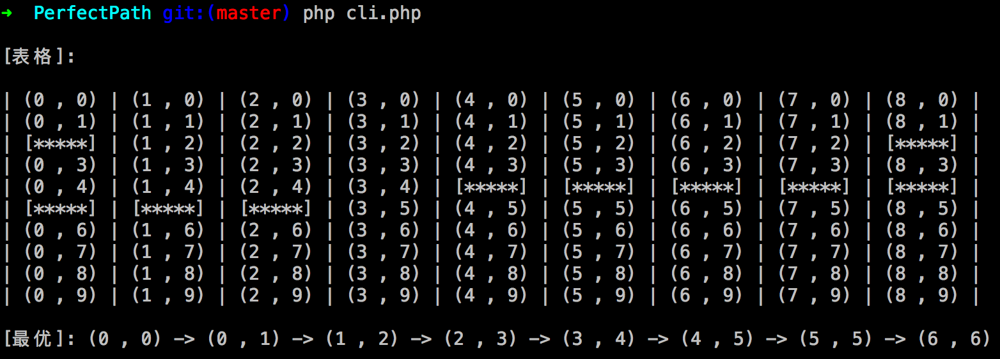

### 使用方式

#### 1.1 cli.php 为命令行执行脚本

````
php cli.php
````


#### 2.1 api.php 为前端 HTTP 请求接口

````
http://localhost/PerfectPath/api.php

````

**METHOD:** GET

**参数:**

````
start   : int,int
end     : int,int
x_num   : int
y_num   : int
diagonal: 1 // 允许走斜角, 1: 允许; 2: 不允许;
blocks  : int,int;int,int;int,int // 障碍点
````

